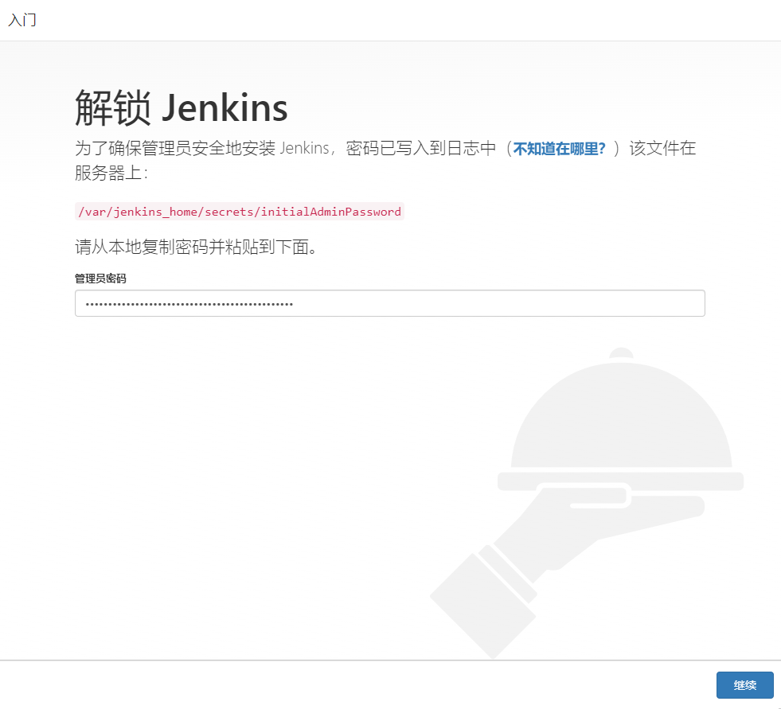
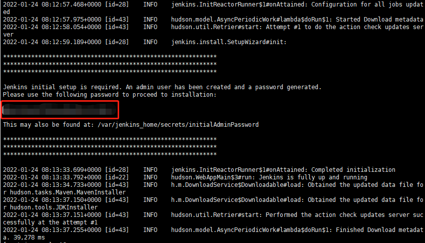

# Jenkins

Jenkins使用docker安装，[docker安装](env/docker.md)

### 安装Jenkins

使用`jenkinsci/blueocean`镜像

```shell
docker run \
  -d \
  -p 9000:8080 \
  -v jenkins-data:/var/jenkins_home \
  -v /var/run/docker.sock:/var/run/docker.sock \
  jenkinsci/blueocean
```

> 参数说明：
>
> - -d  官网示例中--rm和-d两个可选参数都添加了，此处只需要-d，否则会作为foreground job，容器退出时会清理容器的内部数据
> - -p 9000:8080  宿主机和容器的端口映射关系，通过ip:9000访问Jenkins
> - -v jenkins-data:/var/jenkins_home  容器的/var/jenkins_home目录映射到jenkins-data卷，否则重启时Jenkins会重置为新实例
> - -v /var/run/docker.sock:/var/run/docker.sock  使容器可以与docker守护进程通信，官方文档解释是当需要实例化其他docker容器时添加，我的理解是能够实现类似portainer的能力，暂时不知道有什么使用场景，先加上

### 通过上一步配置的端口来访问Jenkins

第一次访问时需要使用自动生成的密码对其进行解锁，因为Jenkins是运行在docker下的，所以无法按图中的地址直接从机器上获取到这个文件。



此处获取管理员密码有两种方式

1. 之前运行时增加了-v jenkins-data:/var/jenkins_home的参数，所以这里将/var/jenkins_home替换为jenkins-data/_data，同时前面拼接上docker配置volumes的默认目录/var/lib/docker，输出内容即为password

```shell
cat /var/lib/docker/volumes/jenkins-data/_data/secrets/initialAdminPassword
```

2. 通过docker的log

```shell
# 获取当前运行的实例
docker ps
# 在上一步的输出中找到Jenkins的CONTAINER ID，再通过此ID查看对应的log
docker logs [CONTAINER ID]
```

在输出的log中可以获取到password



输入密码进入Jenkins之后完成注册和插件安装即可

### 时区问题修改

docker服务中时间默认采用的是UTC，Jenkins构建记录中的时间与北京时间对应不上，需要切换

```shell
docker cp /usr/share/zoneinfo/Asia/Shanghai [CONTAINER ID]:/etc/localtime
```


参考[官网](https://www.jenkins.io/zh/doc/book/installing/)相关内容